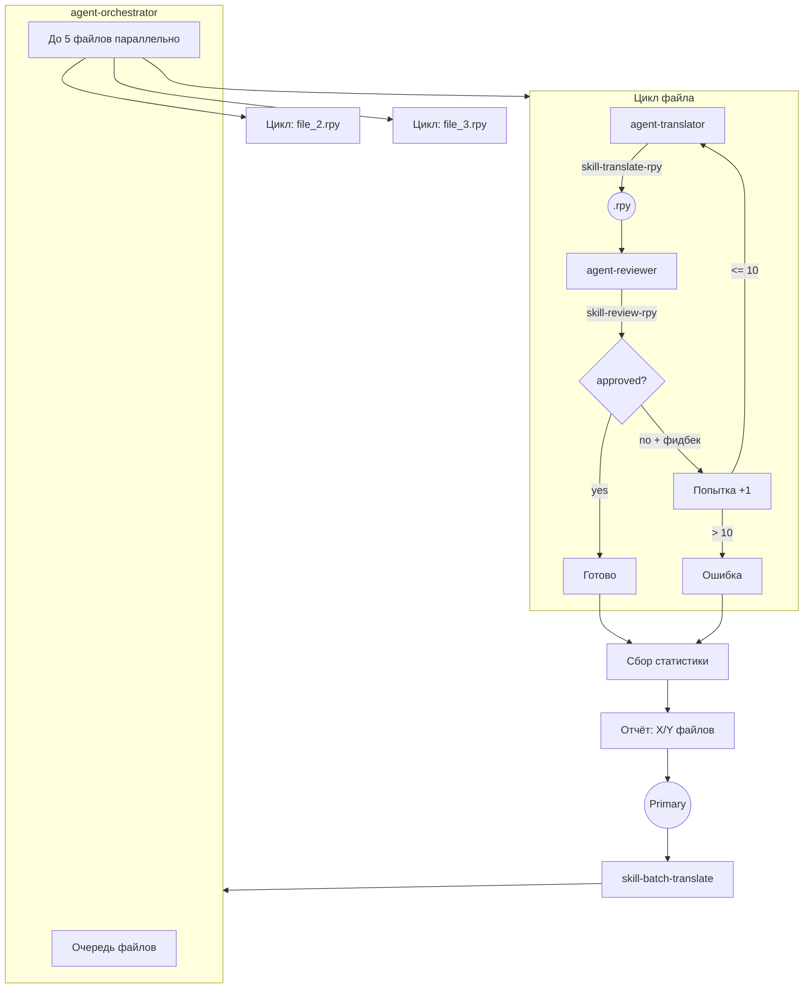

# Архитектура перевода Ren'Py



## Поток данных

```
Primary (Build agent)
  │
  ├── skill-batch-translate ──── инструкция: «запусти оркестратор»
  │
  └── task(agent-orchestrator, [file_1, file_2, ...])
        │
        ├── Для каждого файла (до 5 параллельно):
        │     │
        │     ├── ════════════ ПОПЫТКА 1 ════════════
        │     │
        │     ├── task(general, agent-translator, path + feedback?)
        │     │     └── skill-translate-rpy → переводит .rpy
        │     │
        │     ├── task(general, agent-reviewer, path)
        │     │     └── skill-review-rpy → проверяет качество
        │     │
        │     ├── approved? ──✅──→ готово
        │     │      │
        │     │      └── rejected + issues
        │     │            │
        │     │            ├── ════════════ ПОПЫТКА 2 ════════════
        │     │            ├── task(general, agent-translator, path + feedback)
        │     │            └── ... до 10 попыток
        │     │
        │     └── 10 попыток исчерпаны → ошибка
        │
        └── Отчёт: «ГОТОВО: X/Y файлов (Z ошибок)»
```

## Компоненты

| Компонент | Тип | Файл | Назначение |
|-----------|-----|------|------------|
| agent-orchestrator | agent | `.opencode/agents/agent-orchestrator.md` | Управляет очередью, циклом, retry |
| agent-translator | agent | `.opencode/agents/agent-translator.md` | Переводит один .rpy файл |
| agent-reviewer | agent | `.opencode/agents/agent-reviewer.md` | Проверяет качество, даёт фидбек |
| skill-batch-translate | skill | `.opencode/skills/skill-batch-translate/SKILL.md` | Инструкция для Primary |
| skill-translate-rpy | skill | `.opencode/skills/skill-translate-rpy/SKILL.md` | Инструкция для переводчика |
| skill-review-rpy | skill | `.opencode/skills/skill-review-rpy/SKILL.md` | Инструкция для ревьювера |
