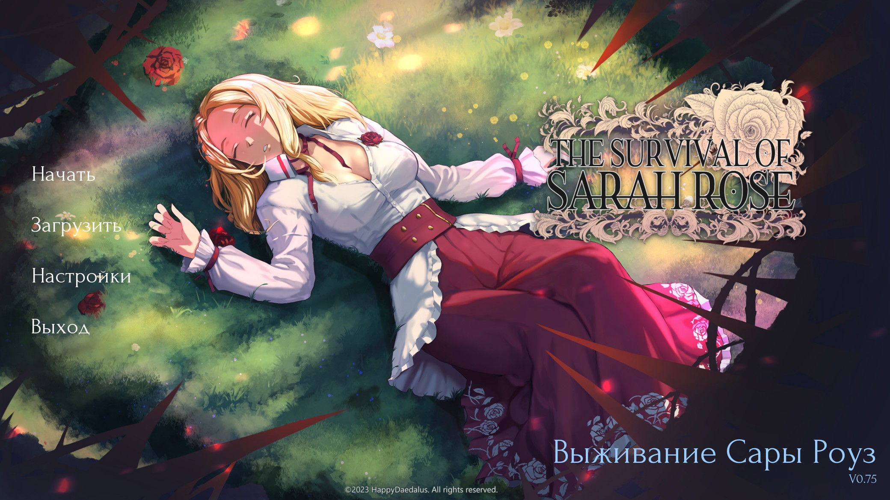
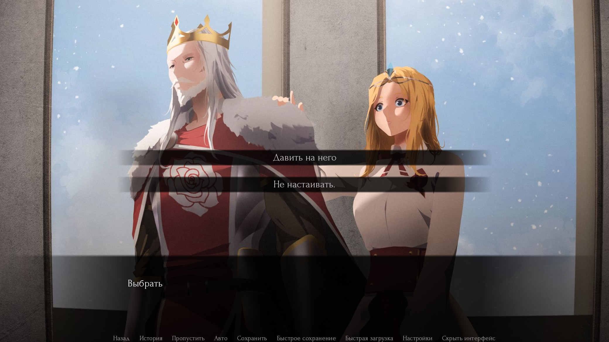
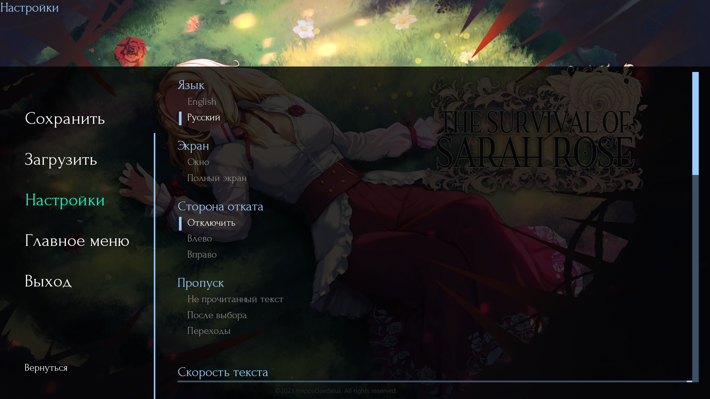
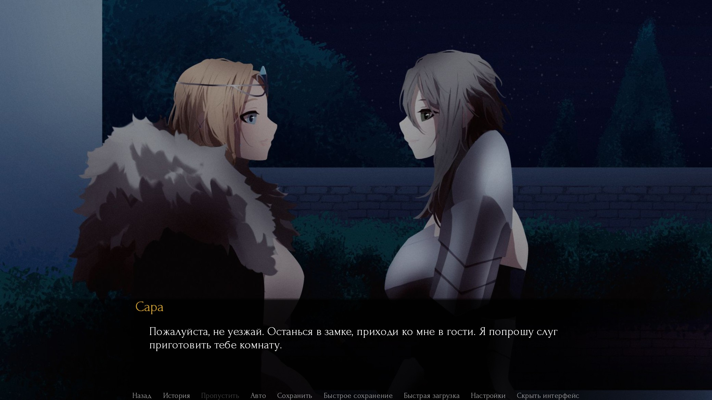

# The Survival of Sarah Rose — Русская локализация (Russian Translation)

[](game/tl/ru/)
[](https://www.renpy.org/)
[](https://store.steampowered.com/)
[](game/tl/ru/)

**Русификатор (русская локализация) визуальной новеллы [The Survival of Sarah Rose](https://store.steampowered.com/app/2166470/The_Survival_of_Sarah_Rose/).**  

Полный перевод диалогов, интерфейса, описаний и внутриигровых текстов на русский язык. Перевод выполняется вручную, с сохранением стилистики и атмосферы оригинала. Проект в активной разработке — новые главы переводятся и публикуются регулярно.

---

## Установка русификатора

Скачать и установить перевод можно одной командой. Откройте терминал в папке с игрой и выполните:

```bash
# Windows (PowerShell)
iwr https://raw.githubusercontent.com/Domovikx/The-Survival-of-Sarah-Rose/master/install.mjs -OutFile "$env:TEMP\install.mjs"; node "$env:TEMP\install.mjs"
```

```bash
# macOS / Linux
curl -sL https://raw.githubusercontent.com/Domovikx/The-Survival-of-Sarah-Rose/master/install.mjs > /tmp/install.mjs && node /tmp/install.mjs
```

Скрипт сам найдёт игру, скачает перевод и очистит кэш Ren'Py.

**Требуется [Node.js](https://nodejs.org/) — скачать и установить.**

---

## Выбор языка в игре

После установки запустите игру. В настройках (Settings) выберите язык **Russian**.

---

## Статус перевода

Актуальное состояние русификации на текущий момент:

| Раздел | Статус |
|--------|--------|
| Пролог (4 файла) | ✅ Переведён |
| StoryBeginnings (10 файлов) | ✅ Переведён |
| Training (12 файлов) | ✅ Переведён |
| misc_strings.rpy (имена персонажей) | ✅ Переведён |
| screens.rpy (интерфейс) | ✅ Переведён (кроме символов) |
| MagePath, WarriorPath, SailorPath | 🚧 В плане |
| UnionKingdom, VargaMarionPath, HassarPath | 🚧 В плане |
| HollowWorld, BlackMonolith, DemonArc | 🚧 В плане |
| PrisonArc, AlfredArc, HyralArc | 🚧 В плане |
| LifeInRahayal, SailorArc, WarArc | 🚧 В плане |
| Other (55 файлов) | 🚧 В плане |

---

## Содержание перевода

- **Пролог** — встреча с отцом, похороны, убийство короля
- **StoryBeginnings** — выбор пути, отъезд в Летрам, Кейт
- **Training** — обучение у наставников (Атилла, Кейт, Калеб и Эфраим)
- **Интерфейс** — все кнопки, меню, настройки
- **Имена персонажей** — полный список имён






---

## Как помочь проекту

Русификатор делается силами сообщества. Вы можете помочь:

- **Нашли ошибку в переводе?** [Откройте issue](https://github.com/Domovikx/The-Survival-of-Sarah-Rose/issues)
- **Хотите улучшить текст?** Сделайте pull request с правками в `game/tl/ru/`
- **Есть вопросы?** [Discussions](https://github.com/Domovikx/The-Survival-of-Sarah-Rose/discussions)

---

## Лицензия

Перевод распространяется на тех же условиях, что и оригинальная игра.
