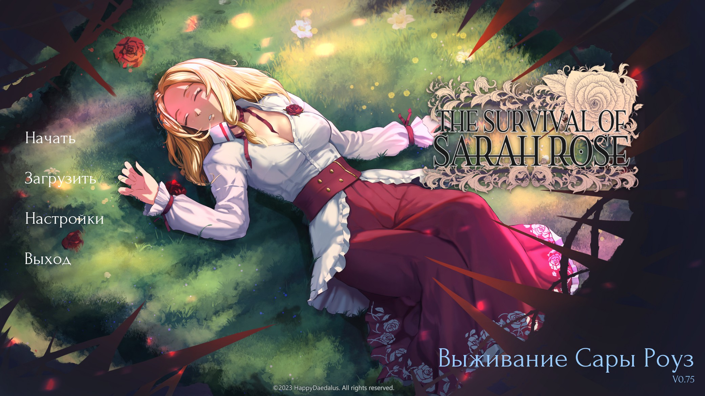
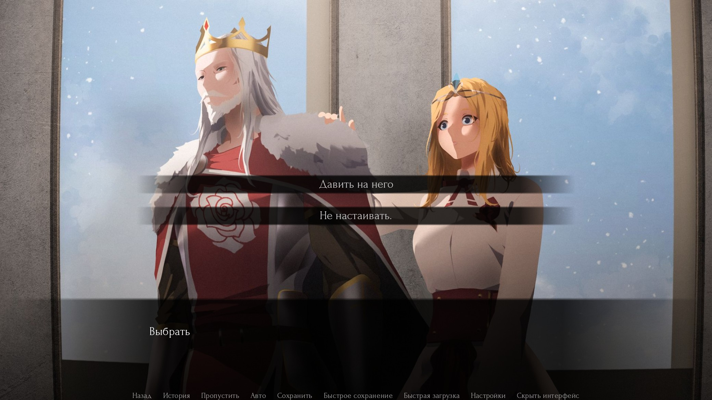
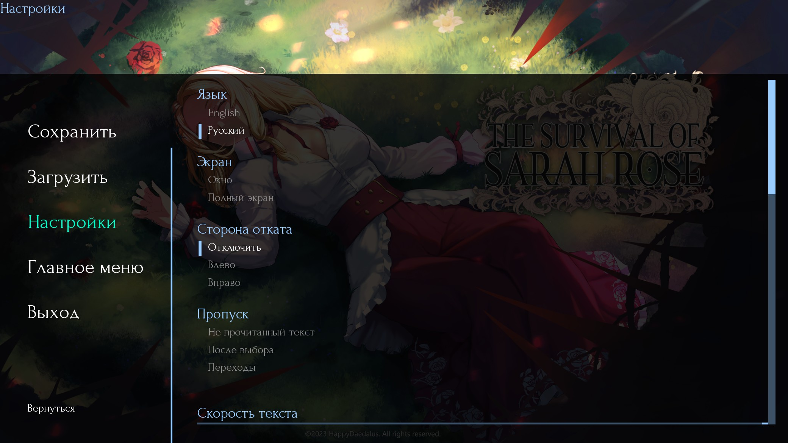
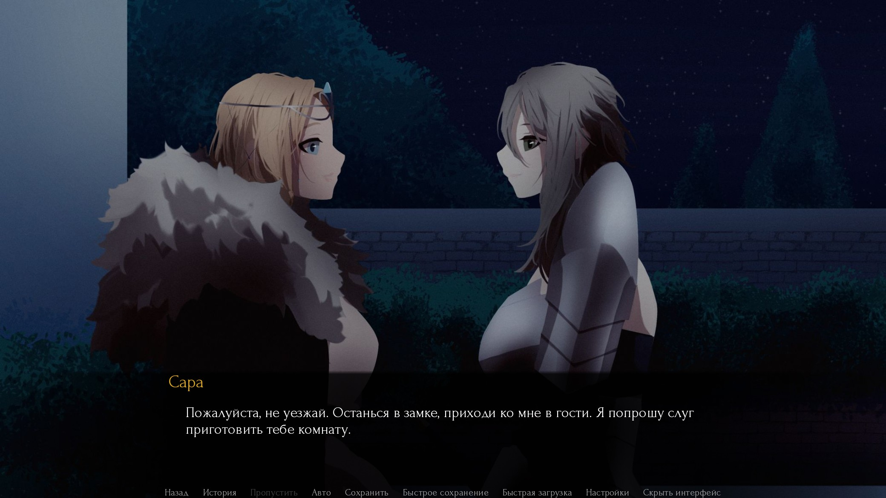

# Русификатор The Survival of Sarah Rose — русская локализация визуальной новеллы

**Русификатор The Survival of Sarah Rose** — полный перевод игры на русский язык. 66 464 строки диалогов, нарратива и интерфейса переведены вручную. Проект с открытым исходным кодом публикуется бесплатно. Дата последнего обновления: май 2026.

---

## Что вы получите с этим русификатором

- **Полный перевод** всех диалогов, описаний и внутриигровых текстов на русский
- **Русский интерфейс** — кнопки, меню, настройки, подсказки
- **Перевод имён персонажей** и географических названий
- **Сохранение стилистики** оригинала — перевод выполнен вручную, без машинного перевода
- **Бесплатно** — проект распространяется под лицензией CC BY-NC 4.0

---

## Как скачать русификатор с GitHub

[**⬇ Скачать ZIP**](https://github.com/Domovikx/The-Survival-of-Sarah-Rose/archive/refs/heads/master.zip) — нажмите, чтобы скачать архив последней версии.

Или через репозиторий:
1. Откройте [github.com/Domovikx/The-Survival-of-Sarah-Rose](https://github.com/Domovikx/The-Survival-of-Sarah-Rose)
2. Нажмите зелёную кнопку **<> Code ▼ → Download ZIP**
3. Распакуйте ZIP-архив в любую папку

## Как установить русскую локализацию The Survival of Sarah Rose

1. Скопируйте папку `game/tl/ru/` из скачанного архива в директорию игры по пути `The Survival of Sarah Rose/game/tl/ru/`
2. Скопируйте файлы интерфейса в корень `game/`:
   - `game/screens.rpy` — интерфейс и шрифт с кириллицей
   - `game/gui.rpy` — настройки GUI
   - `game/options.rpy` — опции игры
   - `game/language.rpy` и `game/language_switcher.rpy` — переключатель языка
   - `game/fonts/Forum-Regular.ttf` — шрифт, поддерживающий кириллицу
3. Очистите кэш Ren'Py: удалите все `*.rpyc` в `game/`
4. Запустите игру. В настройках выберите **Language → Russian**

---

## Содержание перевода

### Пролог и начало игры
- **Пролог** (4 файла, 241 строка) — OpeningScene, старт игры
- **StoryBeginnings** (10 файлов, 1035 строк) — выбор пути, коронация, похороны
- **Training** (12 файлов, 1546 строк) — обучение у Кейт, Калеба, Атиллы

### Основные сюжетные арки
- **WarriorPath** (18 файлов, 8646 строк) — полный путь Воительницы
- **MagePath** (20 файлов, 6729 строк) — полный путь Мага
- **UnionKingdom** (21 файл, 5253 строки) — Объединённое Королевство
- **HollowWorld** (14 файлов, 4485 строк) — HollowWorld для Mage и Warrior
- **BlackMonolith** (19 файлов, 6180 строк) — Чёрный Монолит
- **HassarPath** (12 файлов, 2895 строк) — путь Хассара
- **SailorPath** (11 файлов, 3865 строк) + **SailorArc** (7 файлов, 2719 строк) — путь Моряка
- **LifeInRahayal** (7 файлов, 2556 строк) — жизнь в Рахаяле
- **VargaMarionPath** (12 файлов, 1740 строк) — путь Варги/Марион
- **PrisonArc** (9 файлов), **AlfredArc** (9 файлов), **DemonArc** (3 файла), **WarArc** (2 файла), **HyralArc** (5 файлов)

### Дополнительный контент
- **Other** (55 файлов, 10 861 строка) — дополнительные сцены
- **Интерфейс** — кнопки, меню, настройки, перевод встроенных строк Ren'Py
- **Имена персонажей** — полный перечень с русским переводом

**Итого:** 66 464 строки, **100% перевод завершён**.

---

## Скриншоты русского перевода

---

## FAQ

### Как установить русский язык в The Survival of Sarah Rose?
Скопируйте папку `game/tl/ru/` в директорию игры, файлы интерфейса в `game/`, очистите кэш Ren'Py. В настройках игры выберите язык Russian. Весь процесс занимает 2 минуты.

### Это официальный перевод?
Нет, это неофициальная фанатская русская локализация. Авторы перевода не связаны с разработчиками игры.

### Перевод бесплатный?
Да, русификатор распространяется бесплатно под лицензией Creative Commons BY-NC 4.0.

### Сколько строк переведено?
66 464 строки диалогов, нарратива и интерфейса. Перевод завершён на 100%.

### Как помочь проекту?
Нашли ошибку? Откройте issue на GitHub. Хотите улучшить текст? Сделайте pull request.

### На каком движке игра?
Визуальная новелла создана на движке Ren'Py 8.5. Стандартная система переводов Ren'Py позволяет легко добавлять новые языки.

### Какие арки переведены?
Все 19 арок переведены полностью: Пролог, WarriorPath, MagePath, UnionKingdom, HollowWorld, BlackMonolith, HassarPath, SailorPath, SailorArc, LifeInRahayal, VargaMarionPath, Training, StoryBeginnings, PrisonArc, AlfredArc, DemonArc, WarArc, HyralArc и Other.

---

## О проекте

Русификатор создаётся силами сообщества. Проект с открытым исходным кодом — каждый может внести вклад.

- **Репозиторий:** [github.com/Domovikx/The-Survival-of-Sarah-Rose](https://github.com/Domovikx/The-Survival-of-Sarah-Rose)
- **Игра в Steam:** [The Survival of Sarah Rose](https://store.steampowered.com/app/2166470/The_Survival_of_Sarah_Rose/)
- **Нашли ошибку?** [Откройте issue](https://github.com/Domovikx/The-Survival-of-Sarah-Rose/issues)

---

## Лицензия и отказ от ответственности

**Файлы перевода** (`game/tl/ru/`) распространяются под лицензией [Creative Commons BY-NC 4.0](https://creativecommons.org/licenses/by-nc/4.0/) — вы можете свободно использовать и распространять перевод с указанием авторства, но не в коммерческих целях.

**Отказ от ответственности:** Данный перевод является неофициальной фанатской работой. Авторы перевода не связаны с разработчиками и издателями оригинальной игры. Все права на игру «The Survival of Sarah Rose» принадлежат её правообладателям. Используйте перевод на свой страх и риск.
